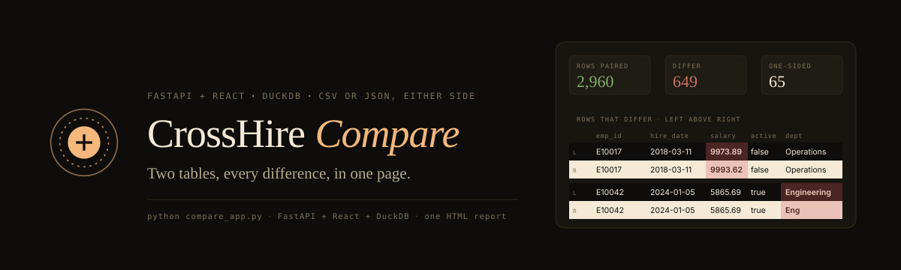
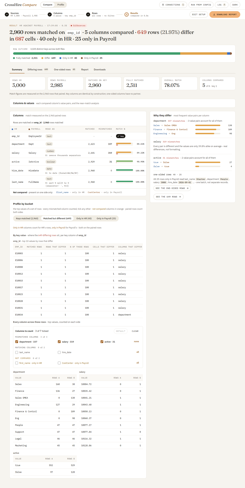
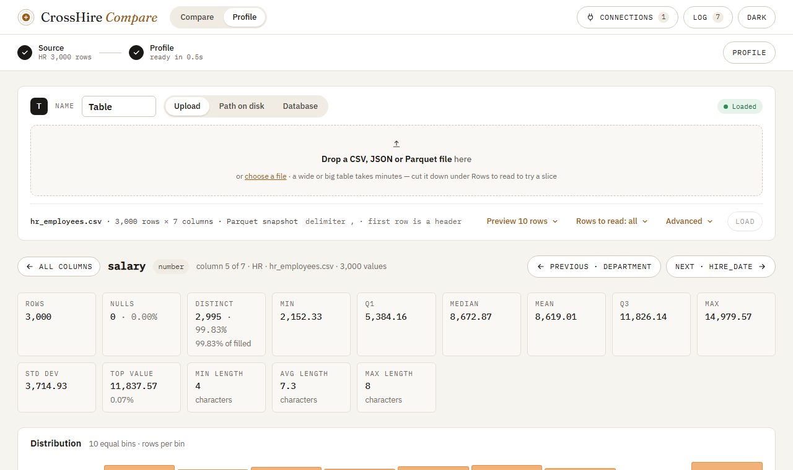

<p align="center"></p>

# CrossHire Compare

Two tables, every difference, in one page.

A page in the browser, served by FastAPI over DuckDB, that compares two tables row by row. Load a CSV, a JSON file or a database table on either side, pair their columns in one table, set the type once, add transform steps where a side needs them, tick the key and press **Compare** - or press **Auto** and let it work the whole thing out, narrating each step. It is built for reconciling two exports of the same data: two systems, two dates, two vendors. Every run leaves one folder with a fixed set of files - a self-contained HTML report you can hand to someone who never opened the app, the differences as CSV or Parquet, and a JSON with every setting the run used. A second page, **Profiling**, takes one table on its own and says what a reader wants to know first: which column identifies a row, what stands out, the statistics of every column, its outliers, shapes and dependencies.


## Contents

- [What it does](#what-it-does) - and [README.html](README.html), the page screen by screen
- [What it looks like](#what-it-looks-like)
- [Install and run](#install-and-run)
- [Try it on the sample pair](#try-it-on-the-sample-pair)
- [How a run goes](#how-a-run-goes)
- [Outputs](#outputs)
- [Speed](#speed)
- [Settings](#settings)
- [Docker](#docker)
- [Theme](#theme)
- [The files](#the-files)
- [The engine on its own](#the-engine-on-its-own)
- [Development](#development)
- [Troubleshooting](#troubleshooting)
- [Related](#related)
- [License](#license)

## What it does

This file is about setting it up, running it and the code. **[README.html](README.html)** goes through the page screen by screen - every card, table, button and file, with screenshots - open it in a browser.

- **Compare two tables.** Load a CSV, a JSON file, a Parquet file or a database table on each side ([Sources](README.html#sources), [Connections](README.html#connections)). Pair their columns in one table, say how each is read and which is the key ([The column table](README.html#columns), [The key](README.html#key)), add transform steps where one side writes a value differently ([Values](README.html#values)), filter or cut the rows ([Rows](README.html#rows)) and press **Compare**. The result is a headline, the counts and every difference, by column and by row, on five tabs ([Compare and results](README.html#compare)).
- **Auto · figure it all out.** Pairs the columns by name and by their values, works out every type and date spelling, finds the key and compares - narrating each step, every decision a cell or a step you can change ([Auto](README.html#auto)).
- **Profile one table.** The Profile page says which columns identify a row, what stands out as a row of findings, the statistics of every column, which columns could be read as another type and how far each column decides the others. Each column gets a page made for its type - a timestamp or a date (span, rows per minute to year, weekends, future and placeholder dates, precision, repeated stamps), a number (digits, places, the `DECIMAL` it fits, round lots), a boolean (the spellings that read true and false, the true rate by another column), the key (nulls, duplicates, width, shapes, prefix, gaps, the next id) and text (a category, free text or a date in disguise, with the values probably spelled twice) - each with its parts, outliers, shapes, frequent values and dependencies ([Profiling](README.html#profiling)).
- **Profile what differs.** On the Results page *Profile by bucket* counts the top values of the matched, differing or one-sided rows; switch it to *Extended* for a row of findings per column and side - nulls, distinct, the top value, shapes, common endings and spellings of one value.
- **Files you can hand on.** Every run writes one folder: a self-contained HTML report, the differences as CSV or Parquet, and a JSON of every setting ([The report](README.html#report), [Outputs](#outputs)). That JSON runs again without the page ([Run it again from a config](README.html#rerun), [The engine on its own](#the-engine-on-its-own)).

## What it looks like

Every screenshot in this file is the app or its report on the sample pair in `examples/` - `hr_employees.csv` against `payroll_employees.csv`, the sides named **HR** and **Payroll** on the source cards (3,000 employees on the HR side, 2,985 on the Payroll side, every column renamed, the two names joined into one, salaries with thousands separators, dates as dd/mm/yyyy, booleans as Y/N). The run is the one in [Try it on the sample pair](#try-it-on-the-sample-pair): **Figure it all out and compare**, then the one step Auto's guess needs, then **Compare**. The other screenshots sit next to the text they illustrate.

The result: the headline sentence and the row-outcome bar, then the Summary tab - the counts as tiles, every column with its match bar (a red sliver beside the green one for the rows it differs on, so 6 mismatches in 600,000 still show), *Why they differ* with the value pairs behind each count, and *Profile by bucket*, which counts the mismatched columns first.

```
Differences · 2,960 rows matched on emp_id · 5 columns compared · 649 rows (21.93%) differ in 687 cells · 40 only in HR · 25 only in Payroll · 0.4s at 22:32:04
```

<p align="center">
  
  
</p>
<p align="center"><sub>A comparison of HR against Payroll, and one column of a profile. Every screen, with pictures: <a href="README.html">README.html</a>.</sub></p>

## Install and run

```
pip install -r requirements.txt   # FastAPI, uvicorn, DuckDB, pandas, pyarrow, PyYAML and the five database drivers
pip install desbordante           # optional - exact key discovery (HyUCC / PyroUCC)

python compare_app.py             # the page at http://127.0.0.1:8501
```

`--port 8600` (or `COMPARE_WEB_PORT`) for another port, `--no-browser` to not open a tab. Stop it with Ctrl+C. It answers on this machine only (`127.0.0.1`). A port already in use is said in one sentence. To compare without the page at all, see [Run it again from a config](README.html#rerun).

Python 3.12 to 3.14; DuckDB 1.2 is the floor the app checks at start. Node is not needed to run it: the page is built into `tablecmp/web_dist/`, which is in the repo. Restart the app after updating files in `tablecmp/`. One `pip install` is the whole install: every database driver is a plain wheel - `snowflake-connector-python`, `databricks-sql-connector`, `pymssql` (FreeTDS is inside the wheel, no ODBC driver), `oracledb` (thin mode, no Oracle client), `psycopg[binary]` - so there is no system package and nothing to install outside pip. `requirements.lock` is the pinned set the Docker image installs; `pip install -r requirements.lock` reproduces it exactly. A driver is only imported when a connection of its kind is used, so a missing one stops that kind alone, with a message naming the package.

Keep `compare_app.py`, `csvdiff.py` (the comparison engine) and the `tablecmp/` folder together - the app stops with a clear message if any of them is missing. There is no config file: the app applies its theme itself when it starts.

## Try it on the sample pair

`examples/` holds the same 3,000 employees as exported by three systems, plus a database with two of them:

| File | What it is | What was planted |
|---|---|---|
| `hr_employees.csv` | The HR system, 3,000 rows: `emp_id, first_name, last_name, department, salary, hire_date, active` | ISO dates, `True`/`False` booleans - the clean side. |
| `payroll_employees.csv` | Payroll, 2,985 rows: `EmployeeId, FullName, Dept, Salary, HireDate, IsActive, CostCenter` | Every column renamed; the two names joined into `FullName`; three departments spelled its own way on about 30% of rows (`Finance & Control`, `Eng`, `Sales EMEA`); salaries as `4,739.85`; dates as `12/01/2026`; `Y`/`N`; a column HR does not have (`CostCenter`); the last 40 employees missing; 25 of its own; a few changed salaries and active flags. |
| `directory_employees.json` | The staff directory, 2,990 objects: `id, name, dept, salary, hire_date, active, manager_id` - numbers and booleans as JSON types | 3% of ids in lower case; one `name` for both names; 10% of departments spelled the directory's way (`People & Culture`, `Customer Support`, `Legal Affairs`), 5% with stray spaces; 8% of salaries changed and 5% with float noise inside a 0.01 tolerance; dates as `06-Nov-2019`; `manager_id` null for 10%; the first 30 HR employees missing; 20 of its own; 1% of active flags flipped. |
| `sample.duckdb` | A DuckDB file with `hr.employees` and `payroll.employees` - the two CSVs as text columns | The database route, with no server to set up. |
| `mapping_hr_directory.json` | The column mapping that reads the directory correctly | Used in the third walkthrough. |

`examples/make_sample.py` regenerates all four data files (seed 7).

### 1. HR against Payroll, with Auto

1. Start the app. On the **A** card type `HR` in the **Name** box, pick **Path on disk** and give the full path to `examples/hr_employees.csv`; press **Load A**. Same for File B: `Payroll`, `payroll_employees.csv`, **Load B**. (The names are what every output file is called after: `HR_compare_Payroll__report.html` and so on; leave them and the files are `Left_compare_Right__*`.)
2. Press **Auto · figure it all out** in the bar at the top.

Auto pairs six columns - `salary` by name, `hire_date` with `HireDate` and `active` with `IsActive` by similar name, `emp_id` with `EmployeeId` as a guess it flags to check, `department` with `Dept` by their values - reads `salary` as a number with a *remove thousands separators* step on Payroll, `hire_date` as a date with *to date (%d/%m/%Y)* on Payroll, `active` as a boolean, finds the key `emp_id` (its reason: *name says identifier · no nulls · 3,000 distinct of 3,000 in HR, 2,985 of 2,985 in Payroll · 98.7% of HR's values found in Payroll · unique by itself*) and compares - the running panel narrating each step, then ending on *Worked out in 1.6s - key: emp_id - comparing now* (the seconds are the machine's own). The verdict is:

```
Differences · 2,960 rows matched on emp_id · 5 columns compared · 2,960 rows (100.0%) differ in 3,647 cells · 40 only in HR · 25 only in Payroll
```

Every matched row differs, and that is Auto's one wrong guess, flagged as such: it paired `last_name` with `FullName` by similar name (*Matched by* says `guess - check`), and `Okafor` is never `Omar Okafor`. The tell is in its decisions, in the Log at the foot of the page - *last_name: 18 distinct values on HR against 361 on Payroll - spelled differently, or a different field* - and the column's expander under Columns & values says *every matched row differs on this column*.

3. In the column table, click **+ Add** in `last_name`'s Transform cell - the values editor opens on that pair - pick **Payroll steps**, add the step *part N split by S* with the separator a single space and N = 2, press **Add**, then **Compare**:

```
Differences · 2,960 rows matched on emp_id · 5 columns compared · 649 rows (21.93%) differ in 687 cells · 40 only in HR · 25 only in Payroll
```

`department` differs on 337 rows (the renamed departments), `salary` on 319, `active` on 31, `last_name` and `hire_date` on none. Those are the numbers the Summary screenshot at the top shows. The Auto-only counts - 2,960 matched, 40 and 25 one-sided, 2,960 differing rows, 3,647 cells - are what the tests assert (`tests/COUNTS.md`).

### 2. The same pair through a database

Set one environment variable before starting the app - the path is taken as written, so make it absolute or relative to the folder you start from:

```
set COMPARE_CONN_SAMPLE=duckdb:///D:/data/crosshire-compare/examples/sample.duckdb     (Windows)
export COMPARE_CONN_SAMPLE=duckdb:////home/me/crosshire-compare/examples/sample.duckdb  (macOS / Linux)
```

1. For File A pick **Database**. The connection `SAMPLE · DuckDB file · …` is already selected; leave **Table** ticked, type `hr.employees`, press **Fetch A**. The rows land as a Parquet file in the work folder and the panel says *Fetched at 10:12:38 - 3,000 rows*; press **Load A**.
2. For File B pick **Database** too, press **Same SQL as A**, change the table to `payroll.employees`, **Fetch B**, **Load B**. The caption under each Load button reads `SAMPLE · DuckDB file · hr.employees - 3,000 rows, 7 columns · fetched 10:12:38`.
3. Press **Auto · figure it all out** - the same verdict as the file route, and the files are `A_SAMPLE_compare_B_SAMPLE__*`, because a database side left at its default name takes the connection's name - and when both sides take the same one, the tag tells them apart.

The DuckDB file holds every column as text, so here the column table's *looks like* cells have something to say - `hire_date` *looks like* `date · 2023-03-04 → %Y-%m-%d` on one side and `date · 04/03/2023 → %d/%m/%Y` on the other, `active` `boolean · True/False` and `boolean · Y/N`, `salary` `number · 12,686.95 has thousands separators` - which is exactly what Auto then decides. (Loaded from the CSV, DuckDB's own sniffer types `hire_date` DATE on both sides, and a column DuckDB already typed gets no suggestion.)

### 3. HR against the directory JSON

`directory_employees.json` with `mapping_hr_directory.json` shows Auto walking into every trap and a mapping file setting it right - [README.html](README.html#sample) goes through it step by step.

## How a run goes

The page is a header and a step rail. The header holds the **Compare** | **Profile** switch, **Connections**, **Run from config**, the **Log** and the light / dark button; the rail under it says where things stand - *Sources*, *Columns*, *Rows*, *Results* - each with a one-line summary, and carries **Auto · figure it all out** and **Compare** on the right. Before anything is loaded the page is the two source cards.

1. **Load A and B on the source cards.** Upload, give a path, or fetch from a database. Each side has a name (Left and Right by default) that is shown everywhere and names every output file - `<left>_compare_<right>__report.html` - so name them; the card reminds you while a side is still called Left or Right. For a big file open *Rows to read* first and cut it down. Each card offers a 10-row preview and nothing else runs.

2. **Check the column table** under the cards. Pairs by name are already made. Fix the rest with the dropdowns, set *Read as*, and set each row to **Key**, **Compare** or **Skip**. The line under the table says what it amounts to: the key, how many columns are compared, what is skipped and which pairs are guesses to check.
3. **Transform where a side needs it.** Click a pair's Transform cell and add steps - trim, left 10, to date (%d/%m/%Y) - previewed on the first five rows, on one side or on both at once. **Add a column** makes a new one from an expression, such as the date out of a datetime.
4. **Press Compare.** While it runs, a panel at the top lists every step done so far, the one running now and the seconds since it started; the steps stay in the Log. The result opens on its tabs and stays until the next run - a failure never wipes it, and a settings change only marks it stale.

Or press **Auto · figure it all out**. Auto pairs the columns, works out every type and date spelling, finds the key and compares, narrating each step; every decision is a cell in the column table or a step in the values editor, and the list of them is in the Log.

To measure one table on its own - its key, what stands out, the statistics, outliers, patterns and dependencies - switch to **Profile** in the header - see [Profiling](README.html#profiling).

## Outputs

Every run writes one folder with a fixed set of files, named after the two sides. The pair name is `<left>_compare_<right>`, each half the side's **Name** box on its source card slugged to letters, digits and underscores (anything else becomes one underscore) - else a database side's connection name, else `Left` / `Right`. The file names play no part. `HR` and `Payroll` give `HR_compare_Payroll`; both sides on the `SAMPLE` connection give `A_SAMPLE_compare_B_SAMPLE`; nothing named gives `Left_compare_Right`, and the card reminds you under a side that is still called Left or Right. Two sides with one name - both on the `SAMPLE` connection - are told apart by their tag everywhere the name is used, not only where a side is picked: the column table's headers, the Files line, the column sheet, the report and the file names read `A · SAMPLE` and `B · SAMPLE`, and the cards say so. A name is a column header and half a file name, so two the same would collide. The run id is the start time, `YYYYMMDD-HHMMSS`, and the folder is `<COMPARE_WORK_DIR>/<pair>__<run_id>/` (the temp folder when the variable is not set). The Downloads tab hands each file out; the names are always:

```
HR_compare_Payroll__report.html      the house-style report (Download report)
HR_compare_Payroll__diff.html        the engine's own side-by-side report (Download engine report)
HR_compare_Payroll__cell_diffs.csv   one line per differing cell: the key columns (the row number in position
                                     mode; an extra occurrence column when a key value repeats), column_name,
                                     left_value, right_value
HR_compare_Payroll__left_only.csv    rows found only in Left: the paired columns under their common names, key
                                     columns included; one-sided columns are not in these files
HR_compare_Payroll__right_only.csv   rows found only in Right, the same way
HR_compare_Payroll__paired.csv       every paired row on one line: the key columns, then a_<column>, b_<column>
                                     for each compared column, in file order - a header only in hash mode.
                                     Written when it is asked for (below), not as the run goes
HR_compare_Payroll__columns.csv      the column sheet: column, name_a, name_b, role, read_as, matched_by,
                                     matched, mismatched, match_pct, values_only_a, values_only_b - matched_by is
                                     how the pair was made (name, similar name, guess - check, data, you, file),
                                     blank on a one-sided column
HR_compare_Payroll__profile.csv      when a profile ran: column, side, rows, nulls, null_pct, distinct,
                                     distinct_pct (of the filled rows), distinct_pct_rows (of all rows),
                                     top_value, top_pct, min, max, mean, avg_length, min_length, max_length
HR_compare_Payroll__summary.csv      one row: schema_version, run_id, started_at, pair, left, right, mode, keys,
                                     rows_left_read, rows_right_read, rows_left, rows_right, matched_rows,
                                     only_left, only_right, diff_rows, cell_diffs, duplicate_keys_left,
                                     duplicate_keys_right, status, tone, seconds, error - lists joined with |
HR_compare_Payroll__summary.json     the whole run for a script: app, engine, duckdb_version, run_id,
                                     started_at, seconds, pair, sources (per side: name, kind, database,
                                     connection name, origin, path, sql, fetched_at, cap, rows, cut, columns -
                                     never a URI or a password), settings (mode, keys, compare_columns, the
                                     specs with their steps and case, column_rules, filters, trim, tolerance,
                                     null_tokens...), result, verdict, notes (Auto's decisions) and files
                                     (every file above with its format, rows and bytes)
```

In key and position mode every file but `paired.csv` is present after every run - an empty table is written with its header - so a script can rely on the set; `summary.csv` and `summary.json` carry `schema_version` 1. Read `columns.csv` by header, not by position: `matched_by` was inserted after `read_as`. In hash mode the engine does not run, so there is no `cell_diffs` file and no engine report - rows either match whole or land in `left_only` / `right_only`, which carry every column, and `paired.csv` is a header only. The engine's CSVs are complete; only the tables on screen and in the report are capped by *Rows to display*.

**The paired rows.** `paired.csv` is the one file a run does not write as it goes. It is a second pass over both sides joined and written out whole - on a 100,000-row, 200-column pair, 19 seconds and 359 MB against the comparison's own 57 - and most runs are read on the page and never downloaded. So **Write the paired rows** on the Downloads tab writes it, once, and after that it is a file like any other: in the folder, in the picker, in `summary.json`, in the Parquet copies and in the zip. The three buttons that say the whole run - **Zip the whole run**, **Write Parquet copies for this run** and **Save everything to folder** - write it first if it is not on disk yet, so nothing they promise is missing.

**Formats.** Tables are CSV; the **Tables as** radio on the Downloads tab - *CSV*, *Parquet*, *both* - applies from the next run, and **Write Parquet copies for this run** adds them to the run on screen. `COMPARE_TABLE_FORMATS=csv,parquet` sets the default. With Parquet on, every table - cell differences, one-sided rows, columns, profile, and the paired rows when they are written - is also written as `.parquet` next to its CSV, typed and a fraction of the size, straight into DuckDB, pandas or a warehouse; `summary.json` lists both.

**The zip.** **Zip the whole run** writes `<pair>__<run_id>.zip`, the whole run folder, and hands it out - written when the button is pressed, not before, and again after Parquet copies are added. Above it a picker holds every file of the run with its size - *Cell differences*, *Rows only in HR*, *Rows only in Payroll*, *Paired rows*, *Columns*, *Profile*, *Summary*, *Settings and result*, *Report*, *Engine report* - and the Parquet copies when they exist - and only the file picked is read: a browser download holds the whole file in memory, and ten of them on every rerun is what made a big run's page slow.

The Downloads tab: the whole run as one zip, then every file of the run folder, the table format switch, and **Save everything to folder**.

**Save everything to folder** copies the run folder to the folder in the box beside it. The default is `<COMPARE_OUT_DIR>/<pair>__<run_id>` when the variable is set - and then every save must stay under it, or it is refused with *Saves must stay under …* - otherwise a folder of that name next to file A, or under your Downloads folder for an upload; the next run's box defaults beside the last save. The report is written at run time, so the folder and the zip always hold it.

**The sweep.** At the first run of a server process the app removes run folders, zips, staged uploads, snapshots, fetches and key-search scratch files in the work folder older than `COMPARE_KEEP_HOURS` (24). Saved folders under `COMPARE_OUT_DIR` are never touched.

## Speed

Nothing heavy runs unless you press it.

- Loading sniffs the schema from a sample and takes one pass to snapshot and count. The 10-row preview stops after 10 rows.
- A plain rerun - editing the table, opening an expander - runs nothing beyond the two 10-row previews and the five-row transform preview.
- Key suggestion, key check, profile, type check and the comparison run only on their buttons. Auto runs them all, once, on purpose, and the key search reuses the profile it just made.
- Finding a key can take minutes on a wide or big table - and so can a profile, which looks for one. Every column is measured, and when no single column is unique every pair of the 24 most key-like columns is counted, then the 300 tightest combinations of three, then of four, and the measures once more when the key-like columns found nothing - over 5,000 rows each level is counted on a random sample of 5,000 rows first, a couple of milliseconds a combination, and only the combinations unique there are verified on every row, a full count each, the tightest first, until one is a key. A designed key is verified in one statement; a wide table with no key at all verifies every coincidence the sample let through - a few minutes at a million rows, and a table too big to hold in memory is counted from the file and is slower still. The running panel says which level it is on. To try a slice first, cut *Rows to read* on the source card.
- A database fetch runs once, streams in 50,000-row batches into Parquet and is kept until the connection, the SQL or the cap changes; put the WHERE in the SQL so the database does the cutting, and give a capped query an ORDER BY.
- The comparison materialises each side as a DuckDB table under the common names, so the engine reads each file once; the key search and the profile do the same while the table fits in a quarter of DuckDB's memory, and read from the file otherwise. Numbers go through a fast 8-decimal decimal first and the wide one only when needed. The value pairs behind every column's count come from one DuckDB pass over the cell differences.
- Null tokens are folded with `list_contains` over a constant list, never `IN (...)`: DuckDB plans an `IN` over constants as a join, and one statement holding a fold per column plans hundreds of them. Reading a 100,000-row x 200-column side took seven minutes that way and takes four seconds this way - the same shape was behind a slow sniff of the values and a slow profile of a wide table.
- One-off measurements, both with the real engine. 500,000 rows x 6 columns: load 1.2 s a side, the comparison itself 7 s (both sides materialised, keyed join, cell differences written), the whole Auto run 16 s including Desbordante and the report. 100,000 rows x 200 columns, 198 of them compared: 4 s to read and type each side, 11 s for the key search when a pair is the key and 15 s when nothing up to four columns is unique, and 57 s for the whole run, 53 s of it in the engine for 19.8 million cells; `paired.csv` is another 19 s when it is asked for. Treat them as an order of magnitude; there is no benchmark script in the repo. The sample pair above compares in about a second.
- The results are drawn one view at a time, and each view draws what is worth drawing: the columns that differ, the first 12 of them open; the key's values in *Profile by bucket*; one file read on the Downloads view, the one picked. A wide pair used to draw a card and two tables per compared column, count every column for every bucket and read every result file into memory on every click, four tabs at once - that is what made a click take seconds.
- The key search on a pair counts one side and verifies what it finds on the other, so a level costs one side's counting, not two - see [The key](README.html#key).
- DuckDB gets three quarters of its own default limit - about 60% of the machine - and a temp directory in the work folder, so past that it spills to disk rather than failing and there is room left for the server, pandas and the browser. `COMPARE_DUCKDB_MEMORY` sets the limit outright when the machine is shared, and with it the table the profile and the key search hold in memory.
- For a very big file, cut it in *Rows to read* first - a date filter or a top N - and keep the Parquet snapshot on.
- A profile works out each column's page before it says done: the table is held in one DuckDB database for as long as the profile is, and every page's figures - the types each column could be read as, the findings, a date's bins, a number's form, a key's gaps, a text column's similar values - are counted then and kept, so opening a column only draws. On a 1,000,000-row, 9-column table the profile takes about 40 s and every column page then opens in under 0.15 s; before, each page counted on its own and took 2 to 10 s, and the could-be-another-type check took 79 s. That check now tries each date and time form on a 20,000-row sample first and only the forms some value there takes on every row - a column of names is no longer parsed seventeen ways a row. A big table takes its time once, on **Profile**, not on every click.
- Every long run ends with its elapsed time on the running panel and in its Log entry, so the Log says which step of which run took the time.

## Settings

There is no settings file. Everything is either in the page or an environment variable read when the app starts:

| Variable | Default | What it does |
|---|---|---|
| `COMPARE_THEME` | `paper` | `aurora` or `violet` switches the whole look - the page and the report - to that palette, opening dark. Anything else falls back to paper. |
| `COMPARE_WEB_PORT` | `8501` | The port the page is served on (`--port` overrides it). |
| `COMPARE_ALLOWED_HOSTS` | empty | Extra Host names the server answers to, comma separated - needed when the page is reached by a machine name, for example in a container. |
| `COMPARE_APP_NAME` | `CrossHire Compare` | The name in the browser tab, the header, the report header and `summary.json`. |
| `COMPARE_APP_TAGLINE` | `Tables, side by side` | A line under the name, where one is shown. |
| `COMPARE_WORK_DIR` | `<temp>/crosshire-compare` | Where staged uploads, Parquet snapshots, database fetches, run folders and zips go, and DuckDB's own temp directory. Created on first use; swept. |
| `COMPARE_OUT_DIR` | unset | When set, the root every save lands under: the save boxes default to `<COMPARE_OUT_DIR>/<pair>__<run_id>` and a folder outside it is refused. |
| `COMPARE_DATA_DIR` | unset | When set, the folders a *Path on disk* may come from, separated by the OS path separator (`;` on Windows, `:` elsewhere). A path outside them is refused: *Not under an allowed folder*. |
| `COMPARE_KEEP_HOURS` | `24` | How old a run folder, zip, upload, snapshot or fetch in the work folder must be before the sweep at server start removes it. |
| `COMPARE_TABLE_FORMATS` | `csv` | The default of the Downloads tab's *Tables as* radio: `csv`, `parquet` or `csv,parquet`. |
| `COMPARE_CONNECTIONS` | `~/.crosshire-compare/connections.json` | The connections file - JSON, or YAML when it ends in `.yml` / `.yaml`. |
| `COMPARE_CONNECTION_FILES` | unset | Shared connections files, JSON or YAML, read-only, separated by the OS path separator (see [Connections files](README.html#connections-files)). |
| `COMPARE_CONN_<NAME>` | - | One connection each, as a URI (see [Connections](README.html#connections)); named `<NAME>`, read-only in the manager, wins over a file connection of the same name. |
| `COMPARE_DUCKDB_MEMORY` | unset | DuckDB's `memory_limit` for every connection the app opens, e.g. `4GB`; a quarter of it is what the profile and the key search may hold a table in - bigger, and they read from the file. |

```
set COMPARE_THEME=violet                              (Windows)
export COMPARE_APP_NAME="Employee Table Check"        (macOS / Linux)
```

Under Docker the image starts `python compare_app.py --host 0.0.0.0 --no-browser` on port 8501. Open it as `http://localhost:8501`; reached by another name, add that name to `COMPARE_ALLOWED_HOSTS` in `.env`. The radii, fonts and colours live in `tablecmp/theme.py`.

## Docker

```
docker build -t crosshire-compare .
docker run --rm -p 8501:8501 -v ./data:/data:ro -v ./out:/out --env-file .env crosshire-compare
```

Or `docker compose up` with the `docker-compose.yml` in the repo. The image is `python:3.12-slim` with the pinned `requirements.lock` installed, runs as the user `app` (uid 1000), starts `python compare_app.py --host 0.0.0.0 --no-browser` on port 8501, and answers a `HEALTHCHECK` on `/api/health`. It sets `COMPARE_DATA_DIR=/data`, `COMPARE_OUT_DIR=/out` and `COMPARE_WORK_DIR=/work`, so inside the container a *Path on disk* must be under `/data`, every save lands under `/out`, and the scratch lives in `/work`.

Compose mounts four things: `./data` read-only at `/data` (the files to compare), `./out` at `/out` (saved runs), a named volume `connections` at `/home/app/.crosshire-compare` (the connections file survives a rebuild) and a named volume `work` at `/work`; and caps the container at 4 GB. Connections come from `.env` - copy `.env.example` to `.env` and put one `COMPARE_CONN_<NAME>=<uri>` per line (a DuckDB file under `./data` is `duckdb:////data/sample.duckdb`). `.env`, `connections*.json`, `*.duckdb`, `docs/`, `examples/` and `tests/` are in `.dockerignore`, so nothing private and nothing large is in the image.

## Theme

The look is **paper** by default: a warm off-white ground, dark ink, an amber accent, Fraunces for headlines, IBM Plex Sans for text and IBM Plex Mono for figures, labels and code. It comes light and dark, with the light / dark button in the header. **Aurora** (a warm near-black ground, cream text) and **violet** are the other palettes (`COMPARE_THEME=aurora` / `violet`), and open dark. The report follows the reader's system setting the same way.

Every colour and font is defined once, in `THEMES` in `tablecmp/theme.py`. `tokens_css()` turns the active palette into a `:root` block; the page's CSS, the report and `README.html` all start with it and refer only to the variables, so the three read as one thing and a palette change is one edit. `/theme.css` serves the tokens from `tokens_css()` to the page.

Side A is blue and side B is brown everywhere the two sides sit together - the column table, the grids, the report, the legends - and the two also differ in lightness, so they can be told apart without colour.

## The files

```
compare_app.py        entry point: bootstrap, theme, the page flow
csvdiff.py            the comparison engine (a black box to the app; runs on its own, see below)
README.html           how it works, in the house style - the same content as this file, for the app's users
README.md             this file
requirements.txt      fastapi, uvicorn, duckdb, pandas, pyarrow, pyyaml and the five database drivers (desbordante optional)
requirements-dev.txt  pytest and pytest-playwright, for the tests
requirements.lock     the pinned set the Docker image installs
Dockerfile            python:3.12-slim, the lock file, user app, port 8501, health on /api/health
docker-compose.yml    build, port, .env, the data / out / connections / work volumes
.env.example          one COMPARE_CONN_<NAME>=<uri> per line
docs/                 banner and screenshots
examples/             hr_employees.csv, payroll_employees.csv, directory_employees.json, sample.duckdb,
                      mapping_hr_directory.json and make_sample.py, which regenerates the data
tests/                the pytest suite: units per module, the page's flows over HTTP (tests/webflow.py, tests/test_web_flows.py), three browser runs in tests/e2e
web/                  the page's source: React + TypeScript, built by Vite
tablecmp/web/         the server: FastAPI
tablecmp/
  theme.py            colours, fonts, the tokens the page and the report share - the only place to change the look
  sql.py              quoting, the scratch DuckDB connection (UTC, temp directory, memory limit)
  filepick.py         Browse: the system file dialog, in a process of its own
  sources.py          one side: a file or a fetched table, which rows to read; schema sniff, snapshot, preview; the work, out and data folders; a folder's files
  connections.py      named connections and folders: the URI form, JSON / YAML connections files, the home-folder store, shared files, COMPARE_CONN_* overrides, redaction
  databases.py        the six dialects, the read-only guard, connect, test, the streamed Parquet fetch
  values.py           transform steps, null folding, types, canonical text, registration, type check
  sniff.py            what a text column's values look like - the looks-like suggestions
  columns.py          the column table: pairing, normalisation, specs, roles and chips, mapping JSON, match by data
  keys.py             key uniqueness, overlap, reasons, Desbordante / DuckDB suggestion - for a pair or one table
  keyformat.py        a key the two sides write differently: the fix that makes it meet, simple or suggested
  profile.py          statistics and value frequencies, of a pair or of one table; what the key search reads from them
  observe.py          what stands out in one table: duplicates, the key, dependencies, correlations, outliers, patterns, the notes
  compare.py          running a comparison (engine, position, hash), filters, and reading it back
  outputs.py          the run folder: pair name, verdict, summary / columns / profile writers, Parquet copies, zip, saves, sweep
  report.py           the HTML report
  auto.py             two sides in, the rest worked out
  runconfig.py        a run as a config file: saved after a run, its sides opened, run again with no page
  run.py              python -m tablecmp.run - a config on one pair of files or many, from the command line
```

The engine is a black box to the app: it receives two DuckDB tables named `src_a` and `src_b` with the common column names and canonical values already applied, and the app reads back its counts and its CSV outputs. Only `tablecmp/web/` speaks HTTP and only `web/` draws the page; everything else is plain Python over DuckDB and pandas, which is what makes the API tests possible.

## The engine on its own

`csvdiff.py` is a generic, config-driven CSV comparison powered by DuckDB, and it runs on its own from the command line - two CSV files, or two folders of them. Everything runs inside DuckDB, so files much larger than RAM are fine. It reports rows present only on the left or only on the right, cell-level differences for rows that matched, and schema differences.

```
python csvdiff.py file  a.csv b.csv --keys id --out out/
python csvdiff.py folder dir_a dir_b --out out/ --keys id
python csvdiff.py config diff_config.yaml --out out/
python csvdiff.py init-config dir_a dir_b -o diff_config.yaml
```

Matching strategies: `key` (join on one or more business-key columns, recommended), `row_number` (line 1 against line 1), `multiset` (order-independent set comparison with duplicate counts), `auto` (key if keys are configured, else row_number). Exit codes: 0 = identical, 1 = differences found, 2 = error.

## Development

Small, verified steps. Before handing over a change:

1. `python -m pip install -r requirements-dev.txt` once - pytest and pytest-playwright.
2. `python -m py_compile compare_app.py tablecmp/*.py` - everything must compile.
3. `python -m pytest tests -q` - the suite (614 tests): the units for every module, the page's flows over HTTP on the sample pair - the file flow and the database flow asserting the counts in `tests/COUNTS.md`, and every response and output grepped for the fake password - the Profiling page, and three runs in a browser (the sample pair, one table profiled, settings kept across the page switch). The database tests set `COMPARE_CONNECTIONS` to a temp file, so your own connections are never read or written.
4. The browser runs need Chromium once: `python -m playwright install chromium` (`--with-deps` on a bare Linux). Without it they skip and say that command.
5. To drive a flow yourself, the way the tests do - check the numbers, not just that it ran:

```python
from pathlib import Path
from tests.webflow import auto, boot, load_path

def test_the_sample_pair(monkeypatch, tmp_path):
    f = boot(monkeypatch, tmp_path)               # the page in memory, temp folders
    load_path(f, "A", Path("examples/hr_employees.csv")); load_path(f, "B", Path("examples/payroll_employees.csv"))
    assert auto(f)["counts"]["matched"] == 2960   # Auto, then the run's counts
```

6. To look at anything visible, run `python compare_app.py`, or take a Playwright screenshot from a test. `examples/make_sample.py` regenerates the sample data (seed 7) when the samples need to change - and then the counts in `COUNTS.md` and here do too.

Conventions the code keeps: identifiers go through `sql.ident`, literals through `sql.lit`, never f-strings into SQL; HTTP only in `tablecmp/web/`, drawing only in `web/`; the app is read-only against databases and no credential reaches an output, a log or the screen; plain, human wording in the UI with captions that say why, and no emojis anywhere; every long run is a job (`tablecmp/web/jobs.py`), so it shows in the running panel and lands in the Log; tables shown to people use thousands separators, blank for not-applicable and a null glyph for a real null; `README.html` is updated when behaviour changes; `csvdiff.py` is not modified by the app's changes.

### Changing the page

Node 24 is needed only to change the screens; running the app needs Python alone. The page's source is in `web/` (Vite, React, TypeScript) and its build is committed in `tablecmp/web_dist/`.

- `cd web`, then `npm install` once.
- `npm run dev` gives hot reload at `http://localhost:5173`, with `python compare_app.py --no-browser` running beside it.
- `npm test` runs the page's tests.
- `npm run build` before committing; `tests/test_web_build.py` fails when the build is older than `web/`.
- `web/.npmrc` sets `legacy-peer-deps`, because `openapi-typescript` still lists TypeScript 5 as a peer.

## Troubleshooting

| Symptom | Cause and fix |
|---|---|
| Every matched row differs on one column | Two different fields paired by mistake (*Matched by* says `guess - check`), or a value that converts on one side only. Check the column in the transform section and press *Check this column on all rows*; the report's value-pair card says the same. |
| Few rows match on the key | Key values spelled differently - case, padding, a prefix, a date format. *Check key* fixes the simple ones and suggests the rest (see *A key written differently*); the summary lists sample unmatched values. Otherwise give the key column a Type or a step. |
| A date column shows as text | Look at its *looks like* cell: add *to date* with that format on the side that needs it, or pick the Type and let the built-in spellings read it. Ambiguous day/month order needs the format spelled out. |
| Auto picked a key that is not unique | It says so, with the reason. Suggest keys shows the alternatives with their overlap; or tick a column in the table. |
| Where Auto's decisions went | Open the **Log** at the foot of the page: the *Auto decisions* entry lists them, one line each, newest run first; the report keeps them under *How this was worked out*. |
| The comparison failed | The message is shown, the step on the rail says *could not finish* and the previous result stays on screen; the Log keeps the steps up to the failure. Usually a filter value or a custom expression DuckDB cannot read - the preview shows DuckDB's own message; a filter value that is not a date or not a number is refused before the run. |
| Header names look like data | Untick *First row is a header* and load again; give names under Advanced if you have them. |
| *Not under an allowed folder (COMPARE_DATA_DIR)* | The server restricts paths on disk to the folders in `COMPARE_DATA_DIR` (`/data` under Docker). Put the file there, or upload it. |
| *Saves must stay under …* | `COMPARE_OUT_DIR` is set; every save goes under it. Use the default folder the box offers. |
| *SQL Server needs the pymssql package: pip install pymssql* | That driver is not installed. `pip install -r requirements.txt` installs all five; a single one installs on its own. |
| *Only SELECT or WITH statements are sent - this one starts with …* / *UPDATE is not allowed in a read-only statement* | The read-only guard. One statement, `SELECT` or `WITH`; a column that happens to be called `update` or `into` must be quoted. |
| *Type the password above first* | The connection was saved without its password (or came from the environment without one): type it in the Database panel's password box, once per session. A held password that is wrong: press **Change password** and type it again. |
| *The fetch failed - …* | The driver's own message, credentials blanked. Press *Test* in the Connections manager to see whether it is the connection or the statement. |
| *A cap without an ORDER BY can give the two sides different rows* | A warning, not a stop: add an ORDER BY to the query, or fetch everything. |
| *Stopped: under 1 GB free in the work folder* | The fetch or the run needs room: point `COMPARE_WORK_DIR` at a bigger disk, or lower the cap. |
| A change to a file in `tablecmp/` does nothing | Restart the app. |
| duckdb too old | `pip install -U duckdb`. DuckDB 1.2+ is needed. |
| Port 8501 is in use | Another app holds it (an older copy of this app, say): stop it, or `python compare_app.py --port 8600`. |

## Related

- [crosshire.ch](https://crosshire.ch), [learn.crosshire.ch](https://learn.crosshire.ch), [blogs.crosshire.ch](https://blogs.crosshire.ch)
- Sibling repos: [crosshire-audit-snowflake-admin](https://github.com/darshanmeel/crosshire-audit-snowflake-admin) - who can actually read a table, transitively; [crosshire-audit-databricks-admin](https://github.com/darshanmeel/crosshire-audit-databricks-admin) - a query library over Databricks system tables.

## License

MIT - see [LICENSE](LICENSE). Copyright (c) 2026 Darshan Singh / Crosshire.
